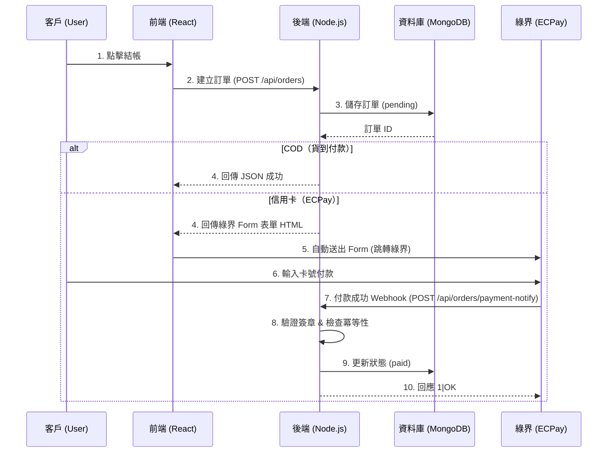
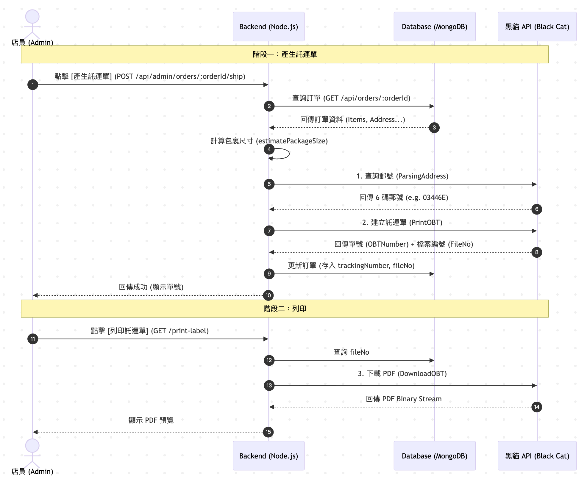

# 紅騷羊肉麵店 - 後端 API

> Node.js + Express 後端服務，處理訂單管理與金流整合

## 🛠️ 技術棧

- **Runtime**: Node.js v18+
- **Framework**: Express.js
- **Database**: MongoDB Atlas
- **Payment**: 綠界 ECPay（信用卡、ATM）
- **Logistics**: 黑貓宅急便 API（冷藏配送）
- **Deployment**: Vercel Serverless

## 📁 專案結構

```
backend/
├── server.js           # 主程式進入點
├── routes/            # API 路由定義
├── controllers/       # 商業邏輯處理
├── services/          # 第三方服務整合
├── .env              # 環境變數（不上傳）
└── package.json      # 專案依賴
```

## 🚀 快速開始

### 1. 安裝依賴

```bash
npm install
```

### 2. 設定環境變數

複製 `.env.example` 並填入你的設定：

```bash
cp .env.example .env
```

### 3. 啟動開發伺服器

```bash
npm run dev
```

伺服器會運行在 `http://localhost:8080`（或使用 `PORT` 環境變數）

## 📡 API 端點

### Public API（不需登入）

| 方法   | 路徑                         | 說明                               |
| ------ | ---------------------------- | ---------------------------------- |
| `POST` | `/api/orders`                | 建立訂單；信用卡回 HTML、COD 回 JSON |
| `GET`  | `/api/orders/:orderId`       | 查詢單筆訂單                       |
| `POST` | `/api/orders/payment-notify` | 綠界付款 Webhook                   |
| `GET`  | `/api/products`              | 取得公開商品列表                   |

### Admin API（需 Bearer Token）

| 方法    | 路徑                                  | 說明                           |
| ------- | ------------------------------------- | ------------------------------ |
| `GET`   | `/api/admin/verify`                   | 驗證登入狀態                   |
| `GET`   | `/api/admin/orders`                   | 查詢訂單（可帶查詢參數）       |
| `POST`  | `/api/admin/orders/:orderId/ship`     | 出貨（呼叫黑貓）               |
| `GET`   | `/api/admin/orders/:orderId/label`    | 下載託運單 PDF                 |
| `POST`  | `/api/admin/orders/sync-status`       | 同步 COD 貨態                  |
| `GET`   | `/api/admin/products`                 | 取得全部商品                   |
| `POST`  | `/api/admin/products`                 | 新增或更新商品                 |
| `PATCH` | `/api/admin/products/:productId/stock`| 更新庫存（`stock` 或 `adjust`）|
| `GET`   | `/api/admin/production/needs`         | 生產需求統計（`start`, `end`） |
| `POST`  | `/api/admin/agent/ask`                | AI 查詢（`question` 等）       |

> 註：`/api/admin/*` 皆需 `Authorization: Bearer <token>`；參數詳情請見 controller 註解。

## 💳 訂單 / 金流流程



## 🚚 物流出貨流程



**階段一：產生託運單**

1. 店員點擊「出貨」→ 後端查詢訂單資料
2. 呼叫黑貓 `ParsingAddress` API 查詢郵遞區號
3. 呼叫黑貓 `PrintOBT` API 建立託運單，取得單號 (OBTNumber) 與檔案編號 (FileNo)
4. 更新訂單狀態為 `shipping`，存入 trackingNumber

**階段二：列印託運單**

1. 店員點擊「列印」→ 後端用 FileNo 呼叫黑貓 `DownloadOBT` API
2. 回傳 PDF 給前端顯示/下載

## 🔒 安全性

- ✅ 環境變數存放敏感資訊
- ✅ CORS 設定限制來源
- ✅ 金流 Webhook 簽章驗證

## 📦 部署

已部署於 **Vercel**：`https://hung-sao-backend.vercel.app`

## 🤝 前端專案

前端 Next.js 專案：[hung-sao-frontend](https://github.com/kaohaohan/hung-sao-frontend)

## 📝 授權

MIT
